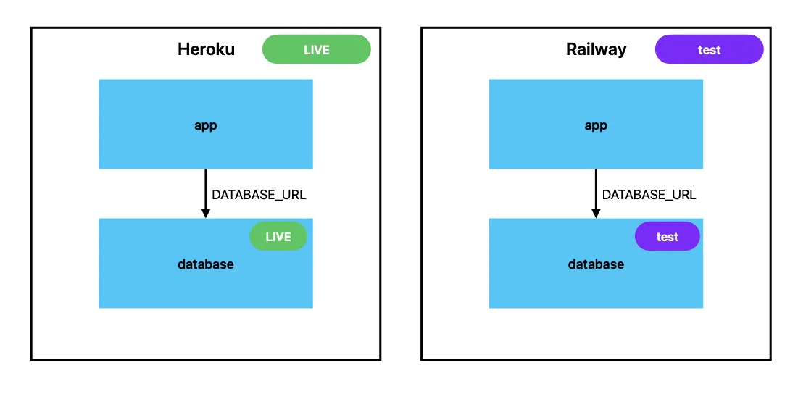
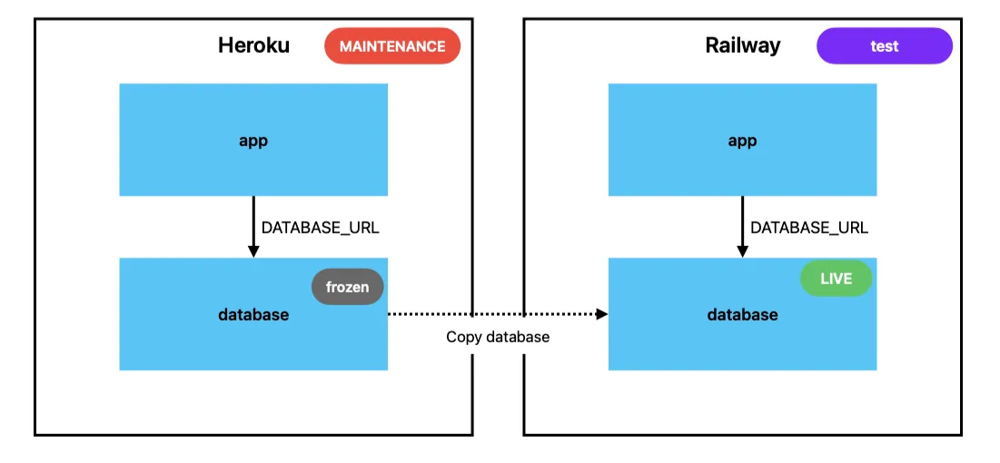
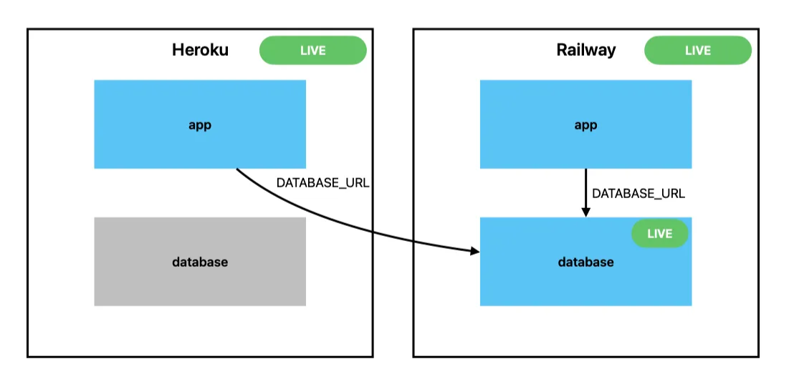
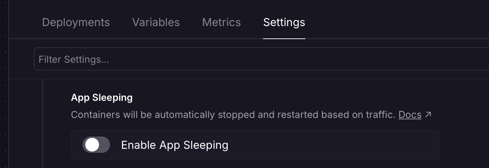
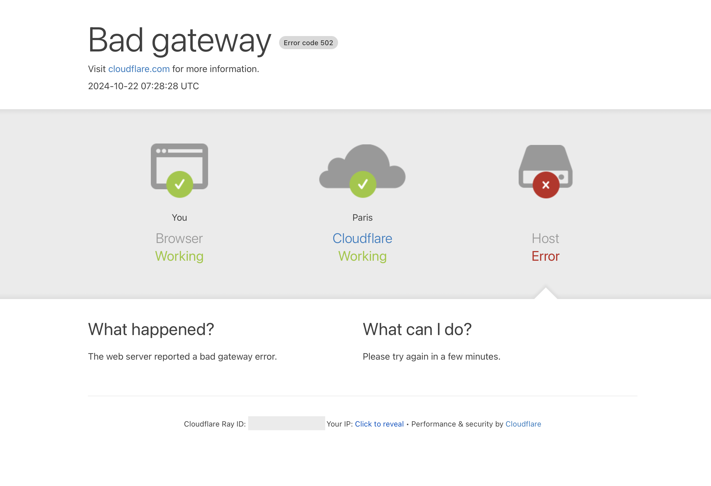

{% extends "%blog_post_base.html" %}
Migrating from Heroku To Railway PaaS
city.jpg
migrate_heroku_to_railway.html
2024-12-20
The promise of modern PaaS technology is to be able to rapidly pack up your software services and take them elsewhere, as easily as moving a festival burrito van. In practice, the process can feel risky and disruptive, and does require careful planning. I hope my experiences can relieve some of your anxiety around the process.
heroku,railway,paas,devops




The promise of modern PaaS technology is to be able to rapidly pack up your software services and take them elsewhere, as easily as moving a festival burrito van. In practice, the process can feel risky and disruptive, and does require careful planning. I hope my experiences can relieve some of your anxiety around the process.


## Who is this for?

Are you thinking about moving from Heroku (or another Platform-as-a-Service (PaaS)) to Railway? Or are you curious about how to migrate live services between PaaSes? In this post I’ll share my some of my experiences with this process.


## Disclaimers

I’m a freelance software developer. I work on a mix of my own and customer projects, and I’m also CTO of JawSpace, a mobile health startup for helping with temporomandibular disorders. Please note that I’m no devops expert; I’m just a developer trying to juggle multiple live services.
I didn’t write this as a definitive Heroku-to-Railway migration guide; it is an informal account of my own experiences migrating a live service with a thousand users a day, which may be useful for your own migration.
This may not be the best or safest way to do a migration - but for me it was the most straightforward and foolproof. I make no guarantees that you won’t have problems with your migration; please consult the official documentation for everything, and make many trial runs in preparation for the switch.
This guide concerns switching a Django app from Heroku to Railway, with a Postgres database, but the principles should hold for other PaaSes and stacks.
I have no real problem with Heroku; it’s served me well for many years, and I’m sure it’s a viable choice for other teams in other circumstances.
Railway sent me a donation for this article, but I independently found my way to Railway because of its merit, and I have been pleased enough with the service that I was motivated to write about my experiences with it.


## Why I wanted to migrate

One of my projects is a studio management system for pole dance and aerial studios. I started it many years ago with some studio owners, and it has steadily gained customers and features.
Back when I started building it, Heroku was one of the only PaaS options. However, in the 2020s, there are many others. Heroku seems to me to have been put in maintenance mode for the last decade, and I had some issues with the service: outages, frequent server restarts, large price jumps for small expansions of the service, and a system which was at-odds with my preference for doing modern container-based design.
I already had some hobby apps running on Railway, plus a couple of customer projects, so I knew I wanted to switch there.


## Anatomy of a migration

I’ll detail all the steps below, but on a high level, what you are doing is seamlessly switching databases: from a Heroku one to a Railway one.
Your app itself is stateless, and should act exactly the same whether it is on Heroku or Railway. You can even have multiple instances of the app running on different PaaSes and sharing a single database, which makes the transition a lot smoother.
This diagram shows the steps to “hot swap” the database between the services. I assume you are already familiar with both platforms, and how the DATABASE_URL environment variable works on both.


Step 1: set up the new Railway server with test data to play with.


Step 2: put the Heroku service in maintenance mode. Migrate the database from Heroku to Railway.


Step 3: set the DATABASE_URL environment variable on the old Heroku server to the new Railway server. Take the Heroku service off maintenance mode.


## The solution

The key to actually getting the migration done was to write a detailed checklist of all the tasks for the migration. This was pretty exciting - I felt like I was switching to a new apartment.
PaaS migration is comparable to a literal migration: moving to a new country or city. When you migrate, you need to: arrange your visa, buy your plane ticket, sign the lease on an apartment, clean your old apartment, pack everything in a shipping container, arrange for someone to give your old keys to the new tenants, purchase utility contracts, and so on.
When planning on moving house or apartment, your plan should mean that you have a roof over your head at all times during the process; likewise, at all times, your software service should not be disrupted, or lose data.
I recommend that you write up a big document with all the steps needed for the migration, including all the shell commands and URLs you will use.
I divided the operation into four phases:

 - Well before the migration day - at your leisure, you can start preparing the groundwork for the migration. This involves getting a test version of the new service running on Railway, with test data.
 - Approaching the day - you can start hooking up all the peripheral services to the new Railway server, and warn your customers that the switch is about to happen.
 - Time of the switch - time to do it! This will probably be late at night wherever most of your users are asleep, so there is a minimum of disruption, if any.
 - After the switch - this involves verifying that the new server is working correctly, and that no user data has been lost. Then slowly shutting down the old server at your leisure.


## Well before the migration day

The first step is to set up the new Railway server with your codebase. You can follow the Railway guides for your particular technology stack. You can take some time to get familiar with Railway, setup the Railway Command Line Interface, and play with test data on your service.
There is not hurry; you can take months to do this, or decide not to go forwards with the migration. Take the time to really get to know the Railway way of doing things. I gave a devops friend access to my project, and he felt that “being on rails” was quite different from what he was used to.
You will need to set up any peripheral services, such as: cron jobs, task queues, automated backups, and maintenance tasks.
Do not forget that you need to find or build the Railway equivalent of all the different Heroku plug-ins you have been using.
With this new deployment, you can also take this opportunity to setup whatever modern paradigms you want: perhaps switching to a Dockerfile deployment instead of buildpacks.


### Database migration

This is the most critical part of the operation. Without your business data, the new service is nothing. Without a seamless switch, real users will be affected - real data will be lost.
I am using Postgres. I practised running the Postgres migration process multiple times. This was not something I wanted to screw up, so I wrote all the steps out with corresponding terminal commands. It would be possible to automate all this, but since I would only be doing it a few times, I manually copy/pasted the correct database URLs from Heroku and Railway’s dashboards at each step:

 - Drop the Railway database full of test data through the Railway dashboard
 - Copy the Heroku database to your local machine. You can get the URL of your Heroku database from the Heroku dashboard:
```
pg_dump -h <Heroku database URL from Heroku dashboard....rds.amazonaws.com> -d <password> database -U <username> -p <port> -W -F t > latest.dump
```

 - Then push that database to Railway:
```
echo "Starting migration..."
echo "Get password from <https://railway.app/project/><your path from dashboard>/service/<more path>/variables"
pg_restore  --verbose --no-owner --no-privileges -U postgres -h <railway DB location>.proxy.rlwy.net -p <port> -W -F t -d railway latest.dump
```
 - Check that the live data from Heroku is in the new database.


### Pro tip: sleep mode

To save some money, you can set your Railway server to sleep when inactive. That way you will not pay for resources whilst you are not testing. You can find this under the “Settings/App Sleeping” tab of your app in the Railway dashboard.



### Big difference between Heroku and Railway: no remote shell on the server!

Heroku gives you shell access to your server, and lets you run command line scripts with cron jobs. In contrast, Railway has a philosophy of containers being stateless, declarative “black boxes”; you cannot get shell access on your server. I understand the reasoning behind this, but it took some getting used to after assuming for my whole life that I can get shell access on all my services.
One gotcha is railway run. This is a "fake" shell which does not work like Heroku's heroku run. It actually runs an environment on your local machine, but copies all the environment variables from your Railway environment locally. It is not a remote shell on the server.
Railway does cron and shell jobs differently from Heroku, so I needed to patch something together so that everything would still work.
For command line jobs: I made everything into Django commands. These can be triggered from a POST endpoint, or run with the railway run system.
I also wrote my own scheduler: here is my github project to give Heroku-like scheduling on Railway: https://github.com/jhud/railway-scheduler


### Second big difference: no automatic seamless deploys

Every time you deploy in Railway, by default you get an annoying 10 seconds of your site being unreachable. This does not happen with Heroku.



After a quick search, I found part of the solution: you need to set a “Healthcheck endpoint”. Railway uses this to know when your server is ready, before it switches to the fresh deployment. It is not a regular heartbeat; it’s only checked whilst the server is being started.
My Django code to create an empty 200 response looks like this in my urls.py file:

```
path('diagnostics/health/', lambda x: HttpResponse(status=200), name="health"),
```

To set up the Healthcheck on the Railway side, follow the instructions here. For this example, I put “diagnostics/health/” as the Healthcheck path.
https://docs.railway.app/guides/healthchecks-and-restarts

Another non-obvious gotcha is that using Railway volumes will also cause this 502 error on deploy. For this and many other reasons, do not be tempted to use the Railway volumes as media storage for anything other than throwaway proof-of-concepts.
After following both of these steps, deploys should be seamless.


### Changing endpoints

It is important that you remove any old API endpoint references to “yourservice.herokuapp.com” in your code or websites before you attempt the migration. I strongly recommend having your own domain name instead of using the default Heroku or Railway URLs. That way you can change servers without changing your endpoints, just by changing your domain name provider settings.
I was a cheapskate and never purchased a domain name for my service, so I needed to buy a domain name and update all my endpoints.

### Picking a time for the migration

Unfortunately, I couldn’t find an easy way to do database replication on Heroku. That means there must be a short break in the service. You want to pick a time to migrate when your service is getting less traffic. Ideally, the process shouldn’t take longer than 15 minutes, but that is still enough time for customers to freak out. So I did mine at midnight, mid-week.


## Approaching the switch (a few days before)

It’s time to get ready! Turn off sleeping on your Railway server, since soon it will be doing real work.
If you have any third-party services with webhooks, such as Stripe or an email service, create duplicate webhooks to point at your new Railway server. If all your persistent state is held in your database, it shouldn’t matter if both old and new servers get the webhook events. Make sure that the events are being dealt with correctly on the new server.
You can email your customers, warning about possible disruptions.
I also added some code around my endpoints to catch HTTP 501-502 errors (service unavailable) and “server not responding errors”, and instead present a nice “we are undergoing scheduled maintenance” message to end users.

### On the day
It’s a matter of hours before the switch.
Now is the time to put a banner message on your service warning about planned upgrades.
You should do another test migration (as you worked out int the previous step) and test the new service with database data which is very close to what will be on the final server.
Test EVERYTHING on the new server.


## Let’s do it!
So, it’s late at night; with sweaty palms, knees weak, arms heavy, it’s time to do the migration, step-by-step.

Do another test database migration for good luck.

**Put Heroku in Maintenance mode** - this will stop the Heroku server from getting any more user interactions or webhooks. Users will see “service unavailable”. Stop any other jobs which may affect the database. From this point on, the database will be frozen.

**Do the actual database migration** - you should be able to do this with your eyes closed by now. That’s it! the new server should be live with the user data “frozen” when you put Heroku in maintenance mode. Check that the Railway server works exactly like the old server.

**Set Heroku server to use the Railway database** - this step is the magic ingredient. It will mean that if anyone finds their way onto the old Heroku service, the data will be updated in the live Railway database instead. You can have both the old and new server running at the same time, but sharing the same new database on Railway. Copy the `EXTERNAL_DATABASE_URL` from your Railway config settings into the Heroku `DATABASE_URL`.
Change your domain name to point to Railway instead of Heroku - this means that when people visit your service’s site, they will go to the new Railway server instead of the old Heroku one.

**Check AGAIN that the Railway server works exactly like the old server.**

**Bring the old Heroku server up** - because we changed the database URL, the Heroku service has an umbilical link to the database in Railway, so if anyone somehow ends up at the old server, they will be updating the new database.

**Check YET AGAIN that the Railway server works exactly like the old server.**

**Check that the Heroku server still works with the raw Heroku service URL.** You can expect that the Heroku service now runs really slowly, since all its database operations need to go over the web. This is where all your N+1 optimization problems will really come home to roost.

**Don’t forget to re-enable any third-party APIs on the Railway server which you disabled for testing.** For example, email and SMS.

**Tell your customers that the migration was successful.** Got to bed for a well-earned rest.
Do not expect that your URL will point to the new server immediately. It may take a couple of days for all the Domain Name Servers around the world to update to your new server.

## After the switch
This was the chronology of my post-migration experience.
I woke up at 6am and checked my phone. No messages. I stumbled to my laptop in my dressing gown. No emails. All the regular scheduled tasks had completed without errors. Phew.

Next time I was in the studios, I asked my customers about the switch. Their reactions to the successful migration: “what?”, “I didn’t notice anything”, “cool. Do I need to care about it?” I was slightly disappointed that I didn’t get a standing ovation, but I guess customers not noticing or caring about the plumbing is the ideal result.

I hung onto the Heroku database for a few days in case there were problems, but then deleted it to save some money.

I gradually let users of the old server dwindle as the WWW updated itself, then eventually killed the old server after a few weeks.

The only complaints were from some people who were hitting the old server and noticing the glacial performance, but I just sent them the new link.
After a few weeks, I shut down the Heroku server completely.

Now everything is about 75% cheaper, faster, and with more flexibility. There’s more room to grow my service and set up new features for my customers.

I didn’t just reap the benefits of moving to a more modern server. Migration forced me to better abstract my service from the platform layer. My deployment plumbing is now necessarily more scalable and modular. Plus, if I did it once, it is easily doable again if needed.

# Conclusion
I hope this was helpful to you. If you have your own thoughts, I’d be interested to hear them, especially since devops is not my forte. https://www.disconnectionist.com/


